# Adriantify - New music app

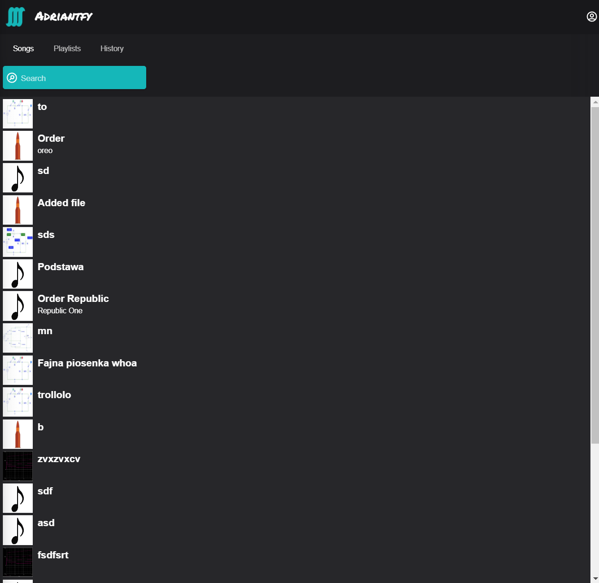

## Run app

### To run the server you need to go to [./server](server/) and run `npm start` command

### To run client you need to go to [./client](front/) and run `npm run dev` then go to localhost

### On server create .env file and fill it [.env.sample](server/.env.sample) file should help you

### If you are using other port than 3000 for front app then you should change origin in [config.js](server/config.js) to avoid cross origin problems

## Overview

1. Server technology

    * node, express
    * mongoose for MongoDb connection

2. Client technology

    * Vue 3
    * Typescript
    * Tailwind

### Register your account

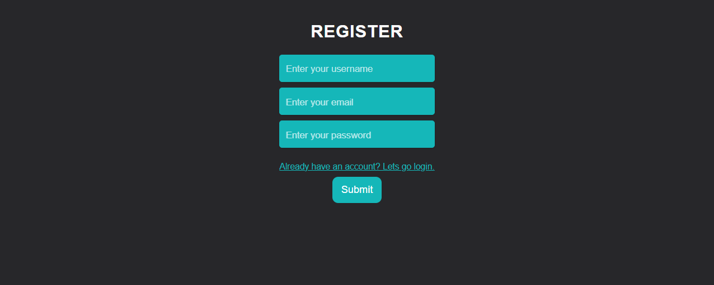

### Login to app

### Listen to the song

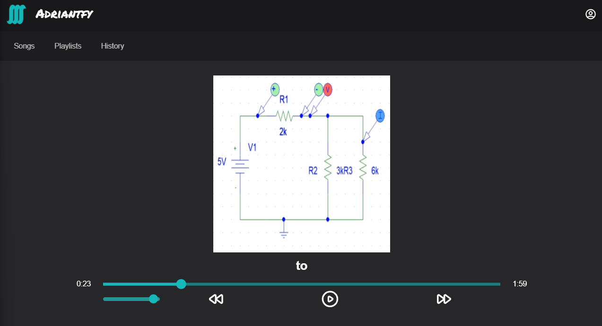

### Listen and control the song everywhere in the app

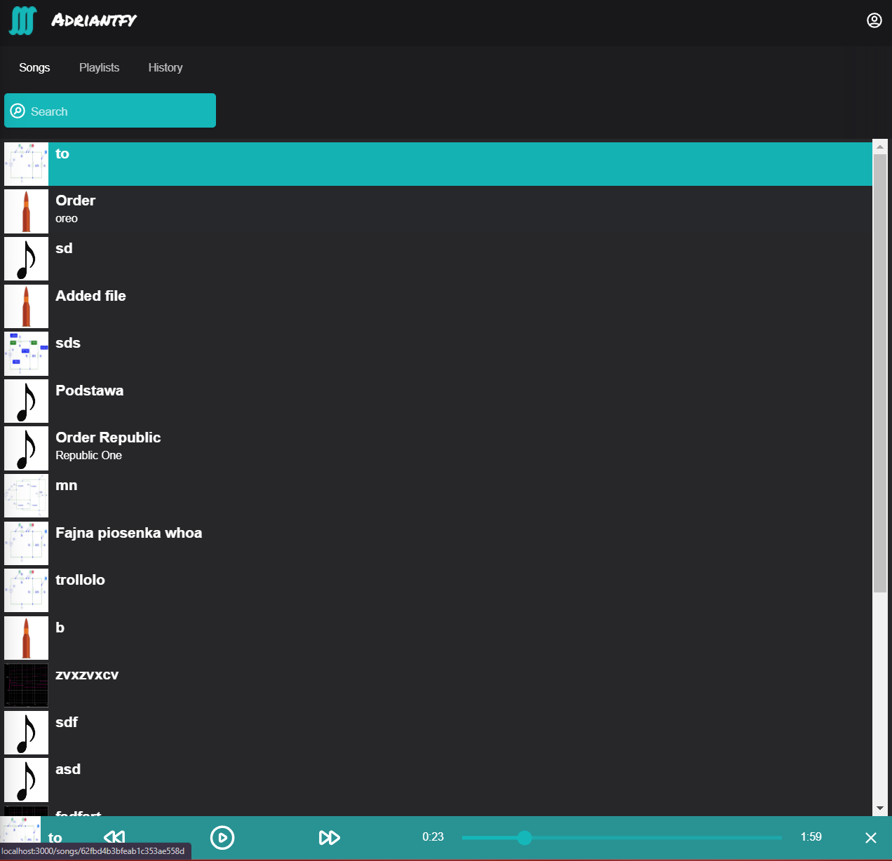

### Search for the song or playlist

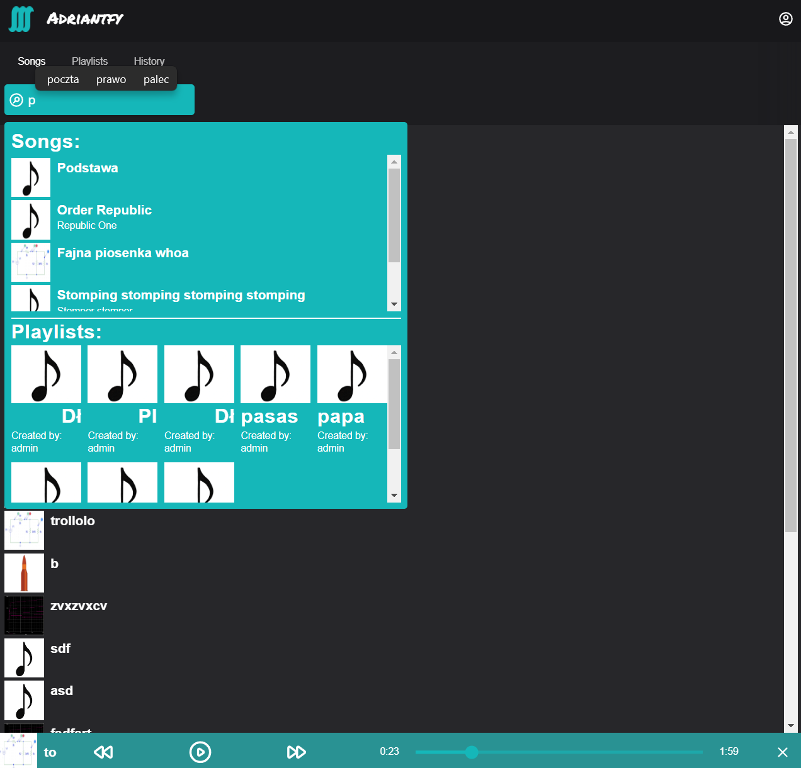

### Discover playlists

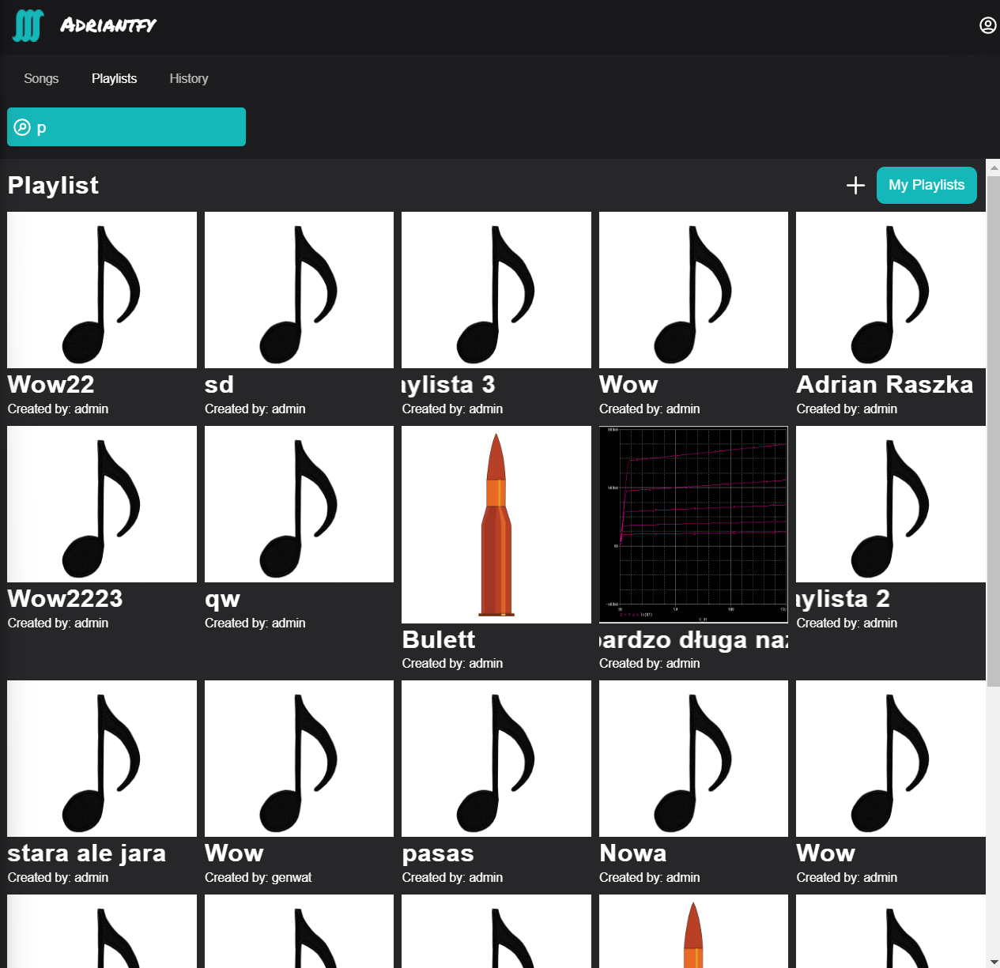

### Filter your own playlists

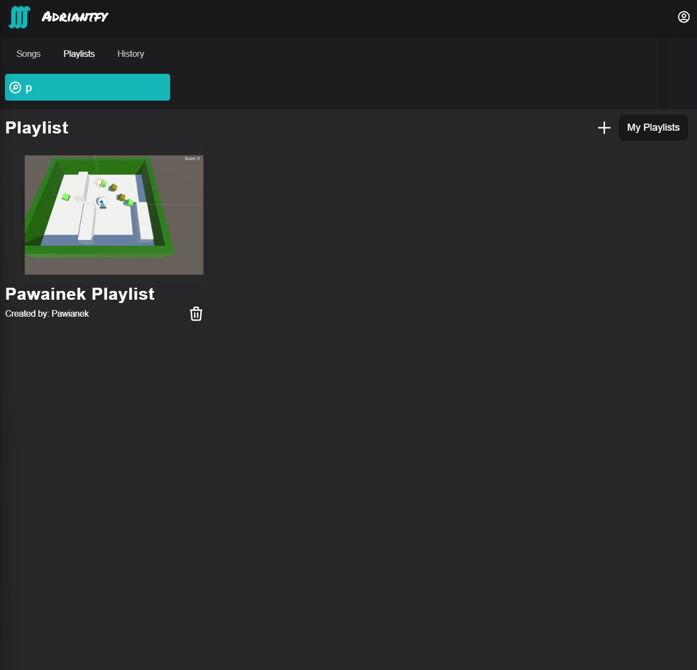

### Create your playlist

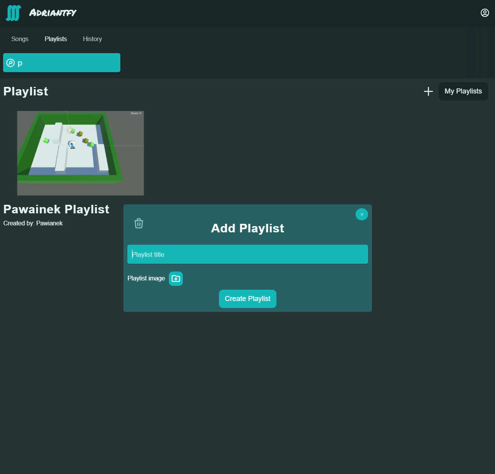

### Manage your history

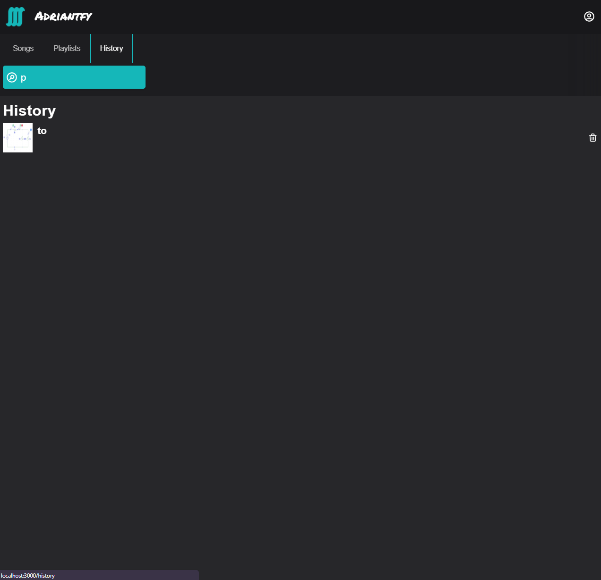

### Logout action

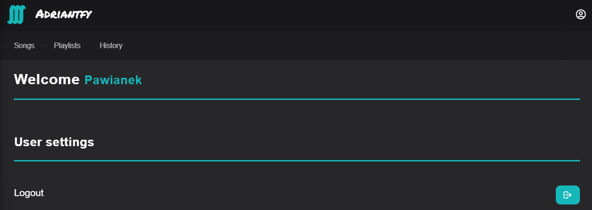

### Login as admin

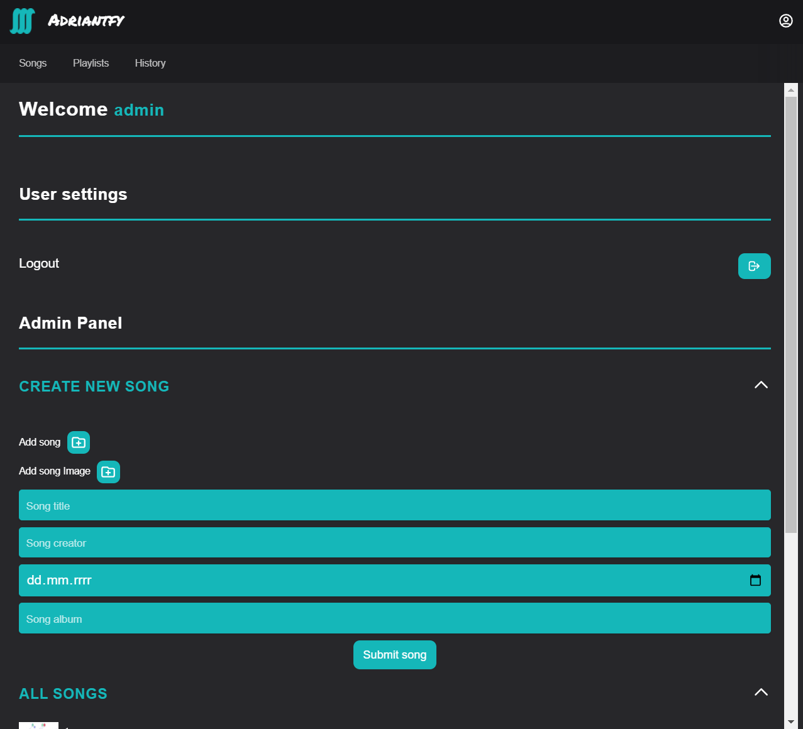

